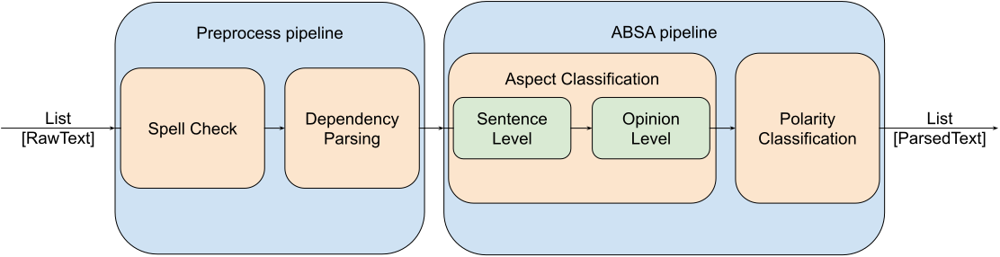

# Essential stages


# Setup

**1) Requirements**

- [Python](https://www.python.org/downloads/) >= 3.7
- [Poetry](https://python-poetry.org/docs/) >= 0.12
- [PyTorch](https://pytorch.org/get-started/locally/) >= 1.5

----------
Execution
----------

Execute `train.py` to train classifiers.<br>
Put your text file to input directory and run `process.py`.

```bash
python train.py
python process.py
```
