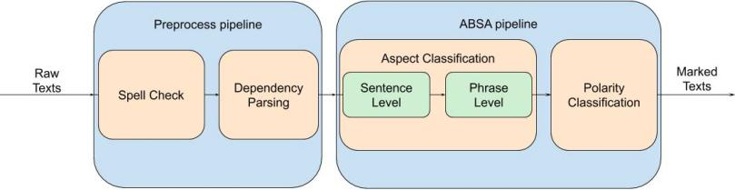

----------
Setup
----------

**1) Requirements**

- `Python <https://www.python.org/downloads/>`_>=3.7
- `Poetry <https://python-poetry.org/docs/>`_>=0.12
- `PyTorch <https://pytorch.org/get-started/locally/>`_>=1.5

**2) Requisites**

To install all requisites you can execute script:

.. code-block:: bash

    ./setup.sh

Or run by yourself:

* Install dependencies with poetry

.. code-block:: bash

    poetry install --no-dev
    printf 'y\n\n' | python -c 'import stanfordnlp; stanfordnlp.download("ru")'

* Download pretrained embeddings

.. code-block:: bash

    wget http://vectors.nlpl.eu/repository/20/185.zip -P ./embeddings/
    unzip embeddings/185.zip -d embeddings/tayga_upos_skipgram_300_2_2019 &&
    rm embeddings/185.zip embeddings/README

Take a look at `RusVectōrēs <https://rusvectores.org/ru/models/>`_ for
another pretrained embeddings. In this case don't forget to replace filename
in `absa/__init__.py <https://gitlab.com/davydovdmitry/absa/-/blob/master/absa/__init__.py>`_

* Download dataset

.. code-block:: bash

    mkdir -p ./datasets/SemEval2016/ &&
    wget --no-check-certificate 'https://drive.google.com/uc?export=download&id=1RZUyBrWQ0OwlIsmN0axewKg21koYmgQf' -O ./datasets/SemEval2016/train.xml &&
    wget --no-check-certificate 'https://drive.google.com/uc?export=download&id=1JR3gblfNXQHApmDzY4FCCjv_0wVug7dO' -O ./datasets/SemEval2016/test.xml

----------
Execution
----------

| Execute `train.py` to train classifiers.
| Put your text file to input directory and run `process.py`.

.. code-block:: bash

    python train.py
    python process.py

------
Essential stages
------
::

            Upload reviews 
                  |
                  V     List[Text]   
                  |
    +-------------------------------------- Preprocess pipeline ---------------+
    |             |                                                            |
    |             V                                                            |
    |         Spell check                                                      |
    |             |                                                            |
    |             |     List[Text]                                             |
    |             V                                                            |
    |      Dependency parsing                                                  |
    |             |                                                            |
    +--------------------------------------------------------------------------+
                  |
                  V     List[ParsedText]
                  |
    +-------------------------------------- ABSA pipeline ---------------------+
    |             |                                                            |
    +-------------------------------------- Aspect Classification -------------+
    |             V                                                            |
    | Sentence Level Aspect Classification                                     |
    |             |                                                            |
    |             |     List[ParsedText]                                       |
    |             V                                                            |
    | Opinion Level Aspect Classification                                      |
    |             |                                                            |
    +--------------------------------------------------------------------------+
    |             |     List[ParsedText]                                       |
    |             V                                                            |
    |   Polarity Classification                                                |
    |             |                                                            |
    +--------------------------------------------------------------------------+
                  |
                  V     List[ParsedText]
